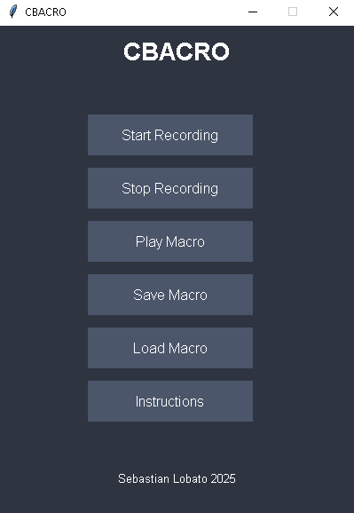

# CBACRO

CBACRO is a desktop application designed for recording, saving, and playing back mouse actions, providing a simple and effective macro automation experience.

## Features
- **Record Mouse Actions:** Track and save mouse clicks with precise timing.
- **Play Macros:** Replay recorded actions seamlessly.
- **Save and Load Macros:** Manage multiple macro files for different tasks.
- **User-friendly Interface:** Simple and intuitive UI for easy navigation.

## Installation
1. Clone the repository:
    ```bash
    git clone https://github.com/yourusername/CBACRO.git
    ```
2. Install the required dependencies:
    ```bash
    pip install -r requirements.txt
    ```
3. Run the application:
    ```bash
    python main.py
    ```

## How to Use
1. Click on **Start Recording** to begin recording your mouse actions.
2. Click on **Stop Recording** to finish.
3. Save your macro using **Save Macro**.
4. Load an existing macro with **Load Macro**.
5. Play your macro using **Play Macro**.

## Screenshot


## Demonstration Video
[](https://github.com/user-attachments/assets/29117adb-b571-45be-a673-e97b5a7c882e)

## Author
**Sebastián Lobato** - 2025

